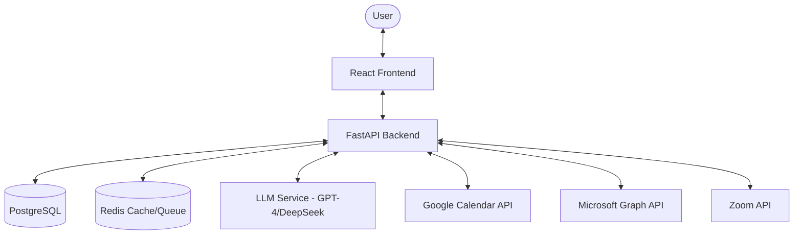

# ChronosAI 🤖

<div align="center">

  
  
  
  
  

  <p align="center">
    <br />
    <b>The Intelligent AI-Powered Meeting Scheduler for the Modern Workspace</b>
    <br />
    <a href="https://chronusai.onrender.com"><strong>Try Live Demo »</strong></a>
    <br />
    <br />
    <a href="#-key-features">Key Features</a>
    ·
    <a href="#%EF%B8%8F-tech-stack">Tech Stack</a>
    ·
    <a href="#-quick-start">Quick Start</a>
    ·
    <a href="#-roadmap">Roadmap</a>
  </p>
</div>

---

## 🌟 Overview

**ChronosAI** revolutionizes calendar management by combining the power of Large Language Models with a seamless, intuitive interface. It acts as your personal executive assistant—understanding complex scheduling requests in natural language, managing availability across platforms, and ensuring you never miss a beat.

### 🎯 Why ChronosAI?
- **Conversational Intelligence**: No more clicking through calendars. Just say "Find a time for a sync with Sarah next Tuesday" and ChronosAI handles the rest.
- **Deep Integration**: Native support for Google Calendar, Microsoft Outlook, Zoom, and Microsoft Teams.
- **Enterprise-Grade**: Built with security and scalability at its core, using OAuth 2.0 and encrypted data handling.

---

## 🚀 Key Features

### 🤖 **AI-First Scheduling**
*   **Natural Language Processing**: Context-aware parsing of meeting requests using GPT-4/DeepSeek models.
*   **Automated Conflict Resolution**: Intelligent rescheduling that respects your existing priorities.
*   **Smart Suggestions**: Recommends the most productive time slots based on your historical patterns.

### 📅 **Universal Sync**
*   **Multi-Platform Integration**: Consolidate Google and Outlook calendars into a single source of truth.
*   **Real-Time Bi-Directional Sync**: Changes translate across all platforms instantly.
*   **Time Zone Mastery**: Automatic detection and adjustment for global teams.

### 🛡️ **Premium Reliability**
*   **OAuth 2.0 Security**: Standardized, secure authentication with major providers.
*   **Real-time Health Monitoring**: Built-in self-pining and rate-limiting to ensure 99.9% availability.
*   **End-to-End Encryption**: Your personal and calendar data is always protected in transit and at rest.

---

## 🏗️ Architecture



---

## 🛠️ Tech Stack

| Component | Technology | Description |
| :--- | :--- | :--- |
| **Frontend** | React 18, Vite, TypeScript | Ultra-responsive & type-safe UI |
| **Styling** | Tailwind CSS, Framer Motion | Modern, premium aesthetics & animations |
| **Backend** | FastAPI, Python 3.11 | High-performance asynchronous API |
| **Database** | PostgreSQL, SQLAlchemy | Robust data persistence |
| **AI/ML** | OpenAI, GPT-4, DeepSeek | Advanced natural language orchestration |
| **Auth** | OAuth 2.0, JWT, Jose | Industry-standard security |
| **Platforms** | Google Cloud, Azure, Zoom | Seamless ecosystem integration |

---

## 🚀 Quick Start

### 📋 Prerequisites
- **Node.js**: v18.0.0+ 
- **Python**: v3.11.0+
- **Database**: PostgreSQL 14+
- **API Keys**: Google OAuth, Microsoft Graph, OpenAI (or compatible LLM)

### ⚙️ Installation

1.  **Clone the Repository**
    ```bash
    git clone https://github.com/johan-droid/ChronusAI.git
    cd ChronusAI
    ```

2.  **Backend Setup**
    ```bash
    cd backend
    python -m venv venv
    source venv/bin/activate  # Windows: venv\Scripts\activate
    pip install -r requirements.txt
    cp .env.example .env.local
    ```

3.  **Frontend Setup**
    ```bash
    cd frontend
    npm install
    cp .env.example .env.local
    ```

### 🔨 Configuration
Ensure your `.env.local` files contain the necessary credentials:
- `DATABASE_URL`: Connection string for PostgreSQL.
- `OPENAI_API_KEY`: Your model provider key.
- `GOOGLE_CLIENT_ID` / `SECRET`: OAuth credentials from Google Cloud Console.

### 🏃 Running Locally
```bash
# Terminal 1: Backend
uvicorn app.main:app --reload --port 8000

# Terminal 2: Frontend
npm run dev
```

---

## 🤝 Contributing

We welcome contributions of all sizes! 
- **Bug Reports**: Open an issue with a clear description and reproduction steps.
- **Feature Requests**: Describe the use case and proposed implementation.
- **Pull Requests**: please follow the existing code style and include tests.

---

## 📄 License

This project is licensed under the MIT License - see the [LICENSE](LICENSE) file for details.

---

<div align="center">
  <p>Built with ❤️ by the ChronosAI Team</p>
  <sub>© 2026 ChronosAI - All rights reserved.</sub>
</div>
